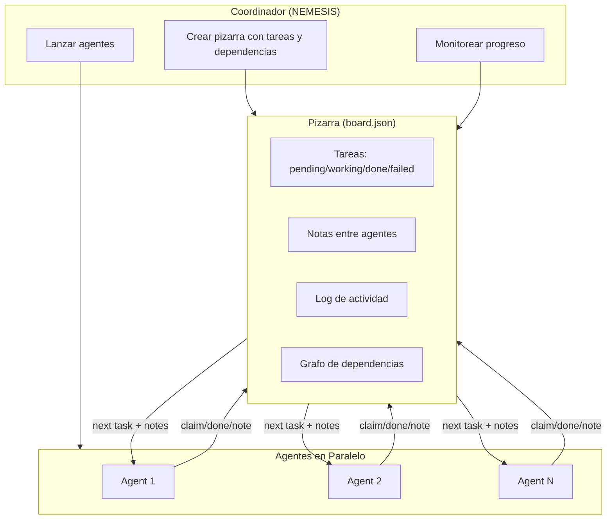
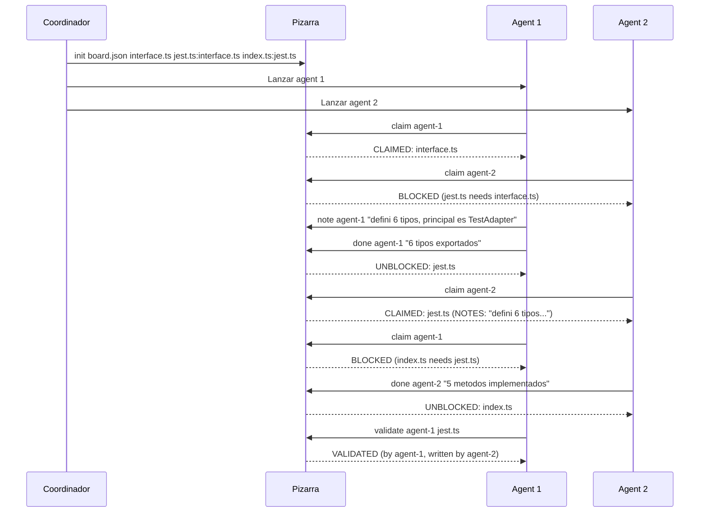
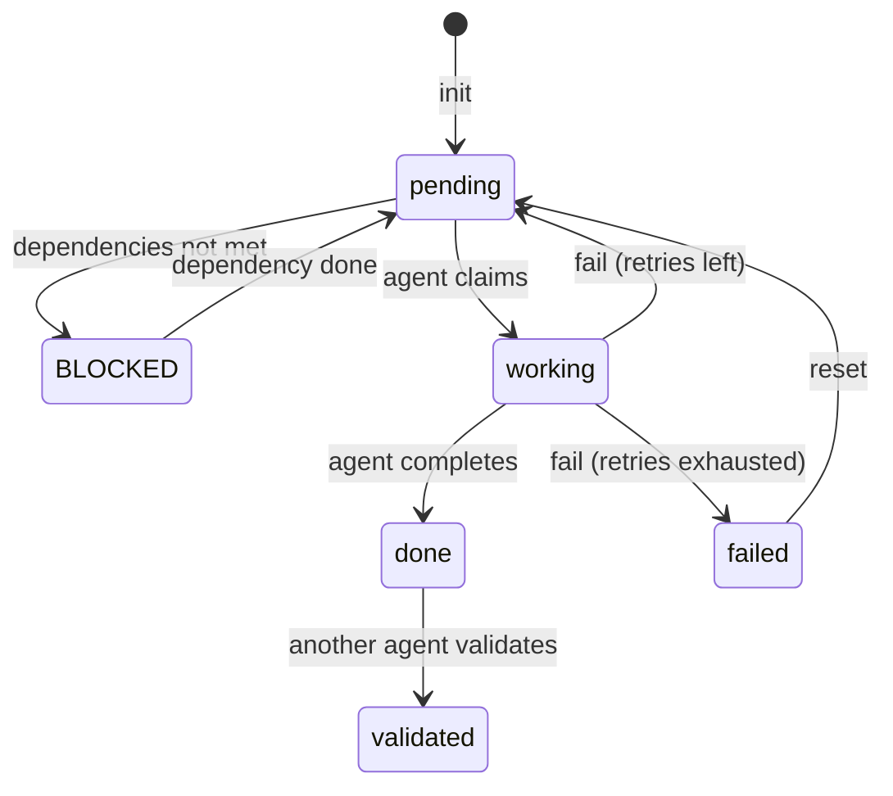

# Sistema de Coordinacion Multi-Agente v2.0

Pizarra compartida para coordinar agentes AI trabajando en paralelo. Evita colisiones, gestiona dependencias, y permite comunicacion entre agentes.

## El Problema

Cuando multiples agentes AI trabajan en paralelo:
- No se ven entre si
- Pueden escribir el mismo archivo al mismo tiempo
- No hay forma de saber el progreso
- Si uno falla, nadie se entera

## La Solucion

Una pizarra (archivo JSON) que todos los agentes leen y escriben:
- Cada agente toma una tarea, la marca como "working", trabaja, la marca como "done"
- Las dependencias se respetan automaticamente
- Los fallos se reintentan automaticamente
- Los agentes dejan notas para los demas
- Las tareas completadas se validan por otro agente

## Arquitectura



## Flujo de Trabajo



## Ciclo de Vida de una Tarea



## Comandos

| Comando | Uso | Descripcion |
|---------|-----|-------------|
| init | `init board.json task1 task2:task1` | Crear pizarra. Dependencias con `:` |
| claim | `claim board.json agent1` | Tomar siguiente tarea disponible |
| done | `done board.json agent1 "mensaje"` | Marcar tarea como completada |
| fail | `fail board.json agent1 "error"` | Reportar fallo (auto-retry) |
| note | `note board.json agent1 "info"` | Dejar nota para otros agentes |
| notes | `notes board.json [task]` | Leer notas |
| validate | `validate board.json agent2 task1` | Validar tarea de otro agente |
| status | `status board.json` | Ver estado completo |
| next | `next board.json` | Ver siguiente tarea disponible |
| wait | `wait board.json` | Verificar si todo termino |
| estimate | `estimate board.json` | Estimar tiempo restante |
| reset | `reset board.json task1` | Resetear tarea fallida |

## 5 Mejoras sobre v1

### 1. Dependencias
```bash
node board.mjs init board.json interface.ts "jest.ts:interface.ts" "index.ts:jest.ts,interface.ts"
```
jest.ts no se puede tomar hasta que interface.ts este done. index.ts necesita ambos.

### 2. Retry Automatico
Si un agente falla, la tarea vuelve a pending para que otro la tome (hasta MAX_RETRIES=2).

### 3. Notas entre Agentes
```bash
node board.mjs note board.json agent-1 "use TestAdapter interface, 6 types exported"
```
Cuando agent-2 tome la siguiente tarea, vera las notas relevantes.

### 4. Estimacion de Tiempo
```bash
node board.mjs estimate board.json
# Avg task duration: 30s | Remaining: 4 | Active agents: 2 | Estimated: ~60s
```

### 5. Validacion Cruzada
```bash
node board.mjs validate board.json agent-2 interface.ts
# VALIDATED: interface.ts (by agent-2, written by agent-1)
```
Un agente no puede validar su propio trabajo.

## Ejemplo Completo

```bash
# Coordinador crea la pizarra
node board.mjs init board.json interface.ts "jest.ts:interface.ts" "vitest.ts:interface.ts" "index.ts:jest.ts,vitest.ts"

# Agent 1 trabaja
node board.mjs claim board.json ag1          # -> interface.ts
node board.mjs note board.json ag1 "6 types: TestResult, SuiteResult, TestCase, etc"
node board.mjs done board.json ag1 "done"    # -> unblocks jest.ts, vitest.ts

# Agent 2 trabaja
node board.mjs claim board.json ag2          # -> jest.ts (sees notes from ag1)
node board.mjs done board.json ag2 "5 methods"

# Agent 1 toma la siguiente
node board.mjs claim board.json ag1          # -> vitest.ts
node board.mjs done board.json ag1 "done"    # -> unblocks index.ts

# Validacion cruzada
node board.mjs validate board.json ag1 jest.ts
node board.mjs validate board.json ag2 vitest.ts

# Ver estado
node board.mjs status board.json
node board.mjs estimate board.json
```

## MCP Server (v2.1)

Ademas del CLI, el sistema se expone como **MCP server** para que consciencias e IAs lo invoquen nativamente sin subprocess manual.

### Instalar

```bash
npm install
```

### Wire-up en .mcp.json

```json
{
  "mcpServers": {
    "blackboard": {
      "command": "node",
      "args": ["C:/ruta/absoluta/a/agent-blackboard/mcp-server.mjs"]
    }
  }
}
```

### Tools expuestas

Los 12 comandos del CLI estan disponibles como tools MCP con prefijo `mcp__blackboard__`:

| Tool MCP | Equivalente CLI |
|----------|-----------------|
| `mcp__blackboard__init` | `init <board> <tasks...>` |
| `mcp__blackboard__claim` | `claim <board> <agent> [task]` |
| `mcp__blackboard__done` | `done <board> <agent> [message]` |
| `mcp__blackboard__fail` | `fail <board> <agent> <message>` |
| `mcp__blackboard__note` | `note <board> <agent> <message>` |
| `mcp__blackboard__notes` | `notes <board> [task]` |
| `mcp__blackboard__validate` | `validate <board> <agent> <task>` |
| `mcp__blackboard__status` | `status <board>` |
| `mcp__blackboard__next` | `next <board>` |
| `mcp__blackboard__wait` | `wait <board>` |
| `mcp__blackboard__estimate` | `estimate <board>` |
| `mcp__blackboard__reset` | `reset <board> <task>` |

### Tests

```bash
npm run test:mcp
```

Ejecuta 15 checks end-to-end contra el server MCP real (init, claim, notes, validate, status, etc).

### Architecture

El MCP server es un wrapper delgado: cada tool invoca `board.mjs` via subprocess. La logica del sistema vive en UN solo archivo (`board.mjs`). Si se agrega un comando nuevo al CLI, solo hace falta extender `TOOLS` y `ARG_BUILDERS` en `mcp-server.mjs`.

---

*SOUL CORE — Sistema de Coordinacion Multi-Agente v2.1*
*Disenado por: Deivi (concepto) + NEMESIS (implementacion) + IRIS (MCP wrapper)*
*v2.0: 2026-04-04 · v2.1: 2026-04-20*
